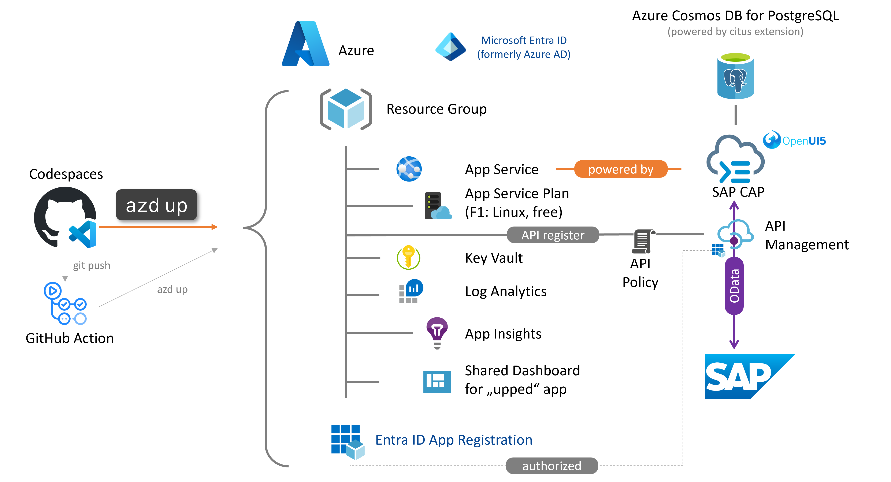

<!-- YAML front-matter schema: https://review.learn.microsoft.com/en-us/help/contribute/samples/process/onboarding?branch=main#supported-metadata-fields-for-readmemd -->

# SAP CAP on Azure App Service Quickstart 🚀

[](https://github.com/codespaces/new?hide_repo_select=true&ref=main&repo=740966807)

This repos serves as quick-start project showcasing [SAP Cloud Application Programming Model (CAP) for Node.js](https://cap.cloud.sap/docs/about/#jumpstart-grow-as-you-go) OData consumption from SAP S/4HANA running on Azure App Services backed with [Azure Cosmos DB for PostgreSQL](https://learn.microsoft.com/azure/cosmos-db/postgresql/introduction). SAP offers a native module [cds-dbs](https://github.com/cap-js/cds-dbs/tree/main/postgres) for PostgreSQL integration.

Understand the difference between Azure Database for PostreSQL and Cosmos DB for PostgreSQL from [this post](https://techcommunity.microsoft.com/blog/adforpostgresql/postgresql-on-azure-%E2%80%93-how-to-choose-what%E2%80%99s-best-for-your-app/3784537).

The project's primary purpose is to set you up for success for your SAP extension project on Azure and reduce the lead time to your first successful deployment as much as possible with developer friendly commands.

It uses the [Business Partner OData v2 API](https://api.sap.com/api/OP_API_BUSINESS_PARTNER_SRV/resource/Business_Partner) from SAP S/4HANA as an example.

The project is setup as per the best practices advocated by the [Azure Developer CLI](https://learn.microsoft.com/azure/developer/azure-developer-cli/overview) and referenced as [official awesome azd template](https://azure.github.io/awesome-azd/?tags=sapcloudsdk).



> [!WARNING]
> Verify the latest [SAP's open-source license](https://github.com/cap-js) for SAP CAP for your reference. Please be aware if your SAP libraries are still using the [SAP Developer License](https://tools.eu1.hana.ondemand.com/developer-license-3_1.txt). Components are being added to open-source by SAP on an ongoing basis according to their road map published [here.](https://blogs.sap.com/2023/10/02/open-sourcing-cap-how-to-learn-more-or-get-involved/) When in doubt, consider the [SAP Cloud SDK on Azure](https://github.com/Azure-Samples/app-service-javascript-sap-cloud-sdk-quickstart) instead.

> [!TIP]
> - In case you need to translate between OData versions and metadata specification use our converter [here](https://aka.ms/ODataOpenAPI).
> - Looking for SAP CAP for Java? See [the SAP docs here](https://cap.cloud.sap/docs/java/getting-started).
> - Looking for the less opinionated SAP Cloud SDK with pug template engine for UI generation? See [the dedicated repos here](https://github.com/Azure-Samples/app-service-javascript-sap-cloud-sdk-quickstart).

## Features ⚙️

Implementations using the approach described by this repo expand the [feature scope](https://cap.cloud.sap/docs/about/) of SAP CAP for Node.js to Azure PaaS apps.

> [!IMPORTANT]
> When deployed on Azure App Services instead of SAP Business Technology Platform, Cloud Foundry specific features like the destination service or XSUAA are not available. Instead you will likely be using Microsoft Entra ID and the App Service and Azure API Management to govern your APIs.

* One code base to run on both Azure App Service and SAP Business Technology Platform
* Built in [resiliency](https://learn.microsoft.com/azure/architecture/reference-architectures/app-service-web-app/multi-region) and caching patterns
* Native [Azure authentication and token handling](https://learn.microsoft.com/azure/app-service/configure-authentication-provider-aad) with Entra ID without any coding effort. Simply switch on the Microsoft Entra ID for your App Service on the AZD config [here](infra/main.bicep) using variable `useEntraIDAuthentication`.
* Configurable Azure API Management integration for SAP APIs including policy enforcement for use cases like request throttling, SAP token caching, etc.
* Native [Azure virtual network integration](https://learn.microsoft.com/azure/app-service/configure-vnet-integration-enable) next to the SAP workload
* Enabled for [SAP Private Link](https://help.sap.com/docs/PRIVATE_LINK/42acd88cb4134ba2a7d3e0e62c9fe6cf/e9cc67716a3a41c9885862661e6c4234.html) and [Azure Private Link / Private Endpoint](https://learn.microsoft.com/azure/app-service/networking/private-endpoint?source=recommendations) (depending on wether you use the SAP Business Technology Platform or Azure only)
* OData v2 and v4 + entity and client generator managed by SAP
* OpenAPI + client generator managed by SAP
* Seamless integration with Azure native databases Azure Cosmos DB, purpose built for cloud native apps
* Frictionless integration of Azure App Service app roles with [SAP CAP authorization model](https://cap.cloud.sap/docs/guides/security/authorization) using [cds-entra-id](https://www.npmjs.com/package/cds-entra-id)
* Out-of-the-box support for remote debugging your CAP application hosted on Azure App Service as described [here](documentation/DEBUG.md).

This example uses a [UI5-based](https://openui5.org) app for rendering the UI. Learn more about other template engines [here](https://expressjs.com/en/guide/using-template-engines.html).

## Getting Started 🛫

### Prerequisites & Installation

Follow the [SAP CAP documentation for Node.js](https://cap.cloud.sap/docs/about/#jumpstart-grow-as-you-go) for your project setup.

Use the devcontainer (with GitHub Codespaces for instance) or install the [Azure Developer CLI](https://aka.ms/azd-install) in your environment.

Use any OData enabled SAP system:

* SAP's [mock server](https://github.com/SAP-archive/cloud-s4-sdk-book/tree/mock-server) (used in screenshots below),
* SAP API Business Hub [S/4HANA Cloud sandbox with APIKey](https://api.sap.com/api/API_BUSINESS_PARTNER/tryout) (⚠️read-only)
* SAP's [public demo system ES5](https://developers.sap.com/tutorials/gateway-demo-signup.html) (⚠️Business Partner API not activated!),
* S/4HANA Fully-Activated Appliance from [SAP Cloud Appliance Library](https://cal.sap.com/) or
* your own available in-house SAP system.

> [!IMPORTANT]
> Be aware that SAP's mock server is anticipating the S4 Cloud version of the Business Partner API. So, you might need to adapt the mock server to your needs. During our testing at the time of release there were no discrepancies discovered. You may expose the mock server running locally for testing with the cloud services to the internet using [ngrok](https://ngrok.com/) or similar tools.

[](https://github.com/codespaces/new?hide_repo_select=true&ref=main&repo=740966807) to hit the ground running with our tailored image and avoid installing anything on your local machine and continue with step 6.

### Quickstart 🚀

Familiarize yourself with the [SAP CAP for Node.js jumpstart guide](https://cap.cloud.sap/docs/about/#jumpstart-grow-as-you-go) and optionally browse SAP Developer tutorials like [this beginner guide](https://developers.sap.com/tutorials/cp-apm-nodejs-create-service.html) and [this end-to-end focused one](https://developers.sap.com/group.btp-app-cap-create.html).

#### Deploy time

0. Run `azd auth login` and `az login` to authenticate with Azure and Azure Developer CLI (AZD). Azure CLI is required for the runtime update of CosmosDB credentials on the Azure App Service during post-provision. See [here](hooks/handleAzureAuthAndDBConnectionString.ps1) for reference.

1. Switch the current working directory to `azd-sub`, containing the `azure.yaml` defining all resources and deployment procedure to bring your application up in Azure.

    ```bash
    cd azd-sub
    ```

2. Run the following command to package a deployable copy of your application, provision the template's infrastructure to Azure and also deploy the application code to those newly provisioned resources.

   ```bash
   azd up
   ```

This command will prompt you for the following information:

- `Azure Location`: The Azure location where your resources will be deployed.
- `Azure Subscription`: The Azure Subscription where your resources will be deployed.

> [!NOTE]
> This may take a while to complete as it executes three commands: `azd package` (packages a deployable copy of your application), `azd provision` (provisions Azure resources), and `azd deploy` (deploys application code). You will see a progress indicator as it packages, provisions and deploys your application.

#### Dev time

1. `cd src/`
2. `npm install`
3. `cp ../templates/.env ./.env` and maintain your OData url including credentials
4. Start Docker engine locally (or use pre-provided devcontainer - Docker outside of Docker feature)
5. `docker-compose -f pg.yml up -d`
6. `cds watch`
7. browse to [http://localhost:4004](http://localhost:4004) for your "hello world"
8. browse to [http://localhost:8080](http://localhost:8080) to use postgres web interface adminer

> [!NOTE]
> Use the hybrid profile `cds watch --profile hybrid` to query the Azure PostgreSQL DB instead of the local dockerized PostgreSQL instance. Note that this requires to have additional credentials set in  `/.env`. See [here](src/README.md) for more details.

## Deploy to Azure 🪂

There are multiple ways to deploy this project to Azure. We provide two options in this repository:

1. via template deployment and VS Code extension. This approach allows an quick deployment to Azure but does not necessarily reflect the best practices. You find more information on this option [here](documentation/DEPLOYMENT-VSCODE.md).
2. via [Azure Developer CLI](https://learn.microsoft.com/azure/developer/azure-developer-cli/overview) using `azd up`. This approach enables a quick and easy deployment and **already contains best practices**. It serves as a **perfect starting point** for a **production grade** setup. You find more information on this option [here](documentation/DEPLOYMENT-AZD.md).

## Deploy to SAP BTP 🪂

Code-based deployment could be done using the recently added [SAP BTP terraform provider](https://developers.sap.com/tutorials/btp-terraform-get-started.html) or the open-source project [BTP setup automator](https://github.com/SAP-samples/btp-setup-automator). The configuration comprises the infrastructure as well as the mta build and the deployment to Cloud Foundry. You can find more information on the setup using the BTP automator [here](https://github.com/Azure-Samples/app-service-javascript-sap-cloud-sdk-quickstart/blob/main/documentation/DEPLOYMENT-BTPSA.md) and for terraform [here](https://github.com/SAP-samples/teched2023-XP160/blob/main/README.md).

## Cost estimates

Solution componenents like the Azure App Service offer [free plans](https://learn.microsoft.com/azure/app-service/overview-hosting-plans#how-much-does-my-app-service-plan-cost). The burstable plans of Azure Cosmos DB for PostreSQL is the primary consumption driver. Consult the [Azure Pricing Calculator](https://azure.microsoft.com/pricing/calculator/) for a detailed view.

## What's next?

You can do a lot more once the app is deployed. Curious? We got you covered with some more information on out-of-the-box **Entra ID (formerly Azure AD) authentication** [here](documentation/AUTHENTICATION.md), insights into networking, OpenUI5 for frontend design and DevOps [here](documentation/WHATS-NEXT.md).

## Troubleshooting 🩺

Sometimes things do not work as expected. Here are some resources that support you in finding and fixing the issue:

* [Access SAP Gateway logs in /IWFND/ERROR_LOG](https://wiki.scn.sap.com/wiki/display/ABAPConn/SAP+Gateway+Error+Log)
* [Azure App Service diagnostics](https://docs.microsoft.com/azure/app-service/troubleshoot-diagnostic-logs)
* Use [Kudu SSH console](https://learn.microsoft.com/azure/app-service/resources-kudu) from VNet integrated App Service to check connectivity to SAP Gateway with `curl https://<your domain>:<your https port>/sap/opu/odata/sap/API_BUSINESS_PARTNER -u "<user>:<password>"`
* [Azure API Management Request tracing](https://learn.microsoft.com/azure/api-management/api-management-howto-api-inspector)
* [Azure API Management Gateway logs](https://learn.microsoft.com/azure/api-management/api-management-howto-use-azure-monitor#view-diagnostic-data-in-azure-monitor)
* [SAP CAP Troubleshooting guide](https://cap.cloud.sap/docs/get-started/troubleshooting)
* [Remote Debug](documentation/DEBUG.md) your application using remote debugging with the Azure App Service extension for VS Code.

## Additional resources

We collected additional resources and related efforts and projects [here](documentation/ADDITIONAL-RESOURCES.md).

## Contributing 👩🏼‍🤝‍👨🏽

This project welcomes contributions and suggestions. Please use GitHub Issues to report errors or request new features. For conceptual conversations, please use GitHub Discussions

This project has adopted the Microsoft Open Source Code of Conduct. For more information see the Code of Conduct FAQ or contact opencode@microsoft.com with any additional questions or comments.

## Trademarks™

This project may contain trademarks or logos for projects, products, or services. Authorized use of Microsoft trademarks or logos is subject to and must follow Microsoft's Trademark & Brand Guidelines. Use of Microsoft trademarks or logos in modified versions of this project must not cause confusion or imply Microsoft sponsorship. Any use of third-party trademarks or logos are subject to those third-party's policies.
