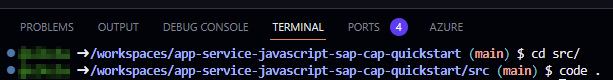

# Remote debugging your CAP application on Azure App Service 🪲

The following steps will show you how to use VS Code to debug your CAP application deployed to an Azure App Service instance.

## Install the required VS Code extension

Connecting to your an App Service instance for debugging requires the "Azure App Service" extension installed in your VS Code. Browse to the [VisualStudio marketplace offering](https://marketplace.visualstudio.com/items?itemName=ms-azuretools.vscode-azureappservice) and click `Install`. Alternatively, you can open the `Extensions` area in your VS Code and search for the extension there.


## Log in to Azure with the VS Code extension

Open the Azure extension in VS Code by clicking the respective icon:


Click `Sign in to Azure` in the `Resources` pane and follow the login procedure to connect to the subscription hosting your application.

Explore your Azure resources in the respective pane in VS Code.


## Set a breakpoint

> [!IMPORTANT]
> The content of the project's `src` directory will be the root directory of the application deployment on Azure. To enable the VS Code extension to link your project files to the respective locations on the App Service side, you will need to open your `src` directory in a new VS Code session.

From the terminal, change your working directory to the project's `src` folder and open a new VS Code session:
```bash
cd src/
code .
```



In the new window, go to your application code and define a breakpoint somewhere in your application code; for example in `srv/health.js`.


## Start remote debugging

Go back to the Azure extension, browse to your App Service instance and select `Start remote debugging` from the context menu.


On first connection, VS Code might ask you to confirm a restart of your application to allow for remote debugging.


Once the application has been restarted and debugging connection established, it won't take long until the Azure platform polls the health probe and VS code will stop at the defined breakpoint to wait for your debugging instructions.


See that remote debugging your App Service with VS Code allows you to...
- ...drill into all variables,
- ...watch expressions,
- ...inspect the call stack,
- ...see your app's console output.

 😎👌 **Happy debugging.** 🪲 🛠️